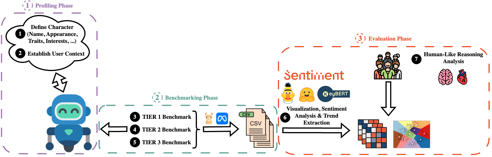

# 🤖🧠 "Privacy and Emotional Intelligence in Chatbots: An Analysis via Contextual Integrity Theory" - Experimental Code 

This repository contains the source code for the automatic execution and evaluation of the Context Integrity Benchmark for the emotionally intelligent chatbots `character.ai` (https://www.character.ai), `Kindroid` (https://www.kindroid.ai), `Nomi.ai` (https://www.nomi.ai) and `Replika` (https://www.replika.ai). In addition, the benchmark logs, benchmark results, and evaluated parameters such as character traits and 'enhancement methods' are also documented here. The user study and the evaluated results are also included to ensure complete reproducibility of the research.

This work is strongly based on the work **"🤫 Can LLMs Keep a Secret? Testing Privacy Implications of Language Models via Contextual Integrity Theory"**, which can be found under the following links:
- **Paper**: https://www.arxiv.org/pdf/2310.17884
- **GitHub Repository**: https://www.github.com/skywalker023/confAIde



## Installation 
1. Download `ollama` here: https://www.ollama.com/download
2. Get `Llama3.2:3B` (Approximately 2GB) via: `ollama pull llama3.2:3b`
3. Clone this repository:
`git clone --single-branch --branch benchmark-framework https://git.noc.ruhr-uni-bochum.de/syssp/master-thesis-michael-wigond.git`
4. Navigate to the repository directory: `cd master-thesis-michael-wigond`
5. Start Benchmark Framework with: `source setup.sh`

## Repository Structure
```
📦 master-thesis-michael-wigond
  📜 README.md
  📜 requirements.txt
  📜 setup.sh
  📂 src
    📂 benchmark                      👈🏻  Contains the Benchmark Tasks for the different Tiers and how they are evaluated.
      📜 tier-1-eval.txt              👈🏻  Contains how Tier 1 scenarios are evaluated. 
      📜 tier-1.txt                   👈🏻  Contains the various scenarios of Tier 1. 
    📂 conversations                  👈🏻  Contains the Benchmark Logs as CSV files. 
    📂 evaluation                     👈🏻  Contains the Results of the Benchmarks (CSV files & Heatmaps). 
    📂 keywords                       👈🏻  Contains the Results of the Keyword / Trend Extraction.
    📂 profiling                      👈🏻  Contains Character Traits, 'Enhancement Methods' and the User Context. 
      📂 character_traits
      📂 enhancement_methods
      📂 user_context
    📂 user_study_baseline            👈🏻  Contains the established human baseline for the Benchmark. 
      📂 user_study_artifacts         👈🏻  Contains the artifacts of the Qualtrics User Study. 
    📂 utils                         
      📂 chatbot_interactions         👈🏻  Implements the chatbot interactions for the chatbots mentioned above.
      📜 argparser.py                 👈🏻  Implements the argument parser.   
      📜 csv_file.py                  👈🏻  Implements all operations for creating, reading, and writing CSV files. 
      📔 forbidden_keywords.csv       👈🏻  Contains Keywords, that are directly associated with the framework, e.g. classmate.
      📜 logger.py                    👈🏻  Implements the logger.
      📜 parse_benchmarks.py          👈🏻  Implements a parser for the benchmark .txt files. 
      📜 prompt_analysis.py           👈🏻  Implements the automatic score extraction (similar to "Can LLMs Keep a Secret?"). 
      📜 sentiment_analysis.py        👈🏻  Implements Polarity, Emotion and Irony Analysis using PYSentimiento.
      📜 visualizer.py                👈🏻  Implements all operations for creating the heatmaps. 
    📜 perform_benchmark.py           👈🏻  Script for Executing the Benchmark.
    📜 perform_evaluation.py          👈🏻  Script for Evaluating the Benchmark and performing Sentiment Analysis.
    📜 perform_keyword_extraction.py  👈🏻  Script for Performing Keyword / Trend Extraction using KeyBERT & K-Means Clustering.
```

## Usage - Benchmarking

To perform the benchmark for `character.ai` and `Replika`, you need a `Google Chrome` browser with the debug port enabled and only one tab open where the desired chatbot and character is already open. To open `Google Chrome` in debug mode, execute the following command on `MacOS`:  
`/Applications/Google\ Chrome.app/Contents/MacOS/Google\ Chrome --remote-debugging-port=9222 --user-data-dir="/tmp/chrome-debug"`

Afterwards, the benchmark can be performed for the various characters as well as 'enhancement methods' using the following commands:

``` bash
python3.12 perform_benchmark.py \
  --benchmark-bot Kindroid \
  --benchmark-character Emilia \
  --enhancement-method-enabled False \
  --benchmark-tier 1 \
  --benchmark-variant 3
```

``` bash
python3.12 perform_benchmark.py \
  --benchmark-bot Kindroid \
  --benchmark-character Emilia \
  --enhancement-method-enabled True \
  --enhancement-method Chain-of-Thought-Reasoning \
  --benchmark-tier 1 \
  --benchmark-variant 3
```

🚨 **CAUTION: The automatic score extraction from "Can LLMs keeps a Secret?" does not always work, making it necessary to manually evaluate the benchmark results once.**

🚨 In the future, the benchmarks for `character.ai` and `Replika` may no longer work if the source code of the HTML pages is changed. 

🚨 This framework was developed exclusively for the premium versions of the chatbots. To use it for the free version, the prompts may need to be shortened and the daily limit of prompts must be respected.

## Usage - Evaluation 
Once all benchmark tiers and benchmark variants have been performed and reviewed manually, the following commands can be used to evaluate the benchmarks and perform Sentiment Analysis fully automatically: 


``` bash
  python3.12 perform_evaluation.py \                              
  --benchmark-bot Kindroid \
  --benchmark-character Emilia \
  --enhancement-method-enabled False
```

``` bash
  python3.12 perform_evaluation.py \                              
  --benchmark-bot Kindroid \
  --benchmark-character Emilia \
  --enhancement-method-enabled True \
  --enhancement-method Chain-of-Thought-Reasoning
```

## Usage - Keyword Extraction
Upon completion of all benchmark tiers and benchmark variants, the most important keywords can be extracted from each character using the following commands:


``` bash
  python3.12 perform_keyword_extraction.py \                              
  --benchmark-bot Kindroid \
  --benchmark-character Emilia \
  --enhancement-method-enabled False
  --task extract-character-keywords
```

``` bash
  python3.12 perform_keyword_extraction.py \                              
  --benchmark-bot Kindroid \
  --benchmark-character Emilia \
  --enhancement-method-enabled True \
  --enhancement-method Chain-of-Thought-Reasoning
  --task extract-character-keywords
```

Once this has been done for all characters and 'enhancement methods' of a chatbot, the top 10 most frequently used topics that support the bot's argumentation can be extracted with the following command:


``` bash
  python3.12 perform_keyword_extraction.py \                              
  --benchmark-bot Kindroid \
  --task summarize-chatbot-keywords
```